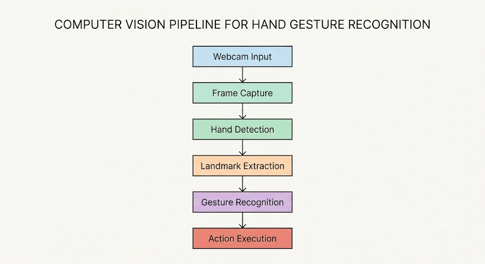
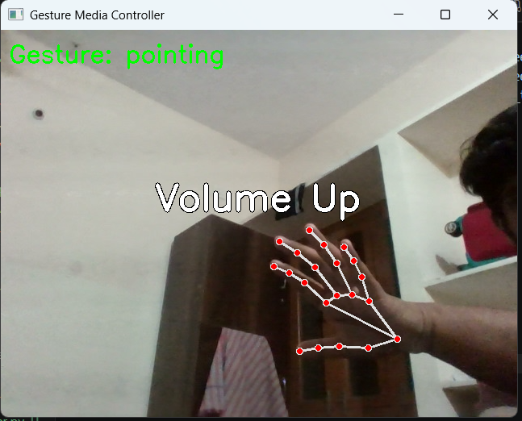
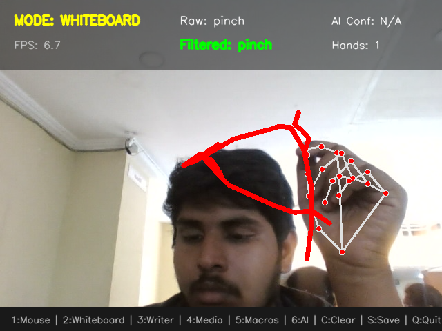
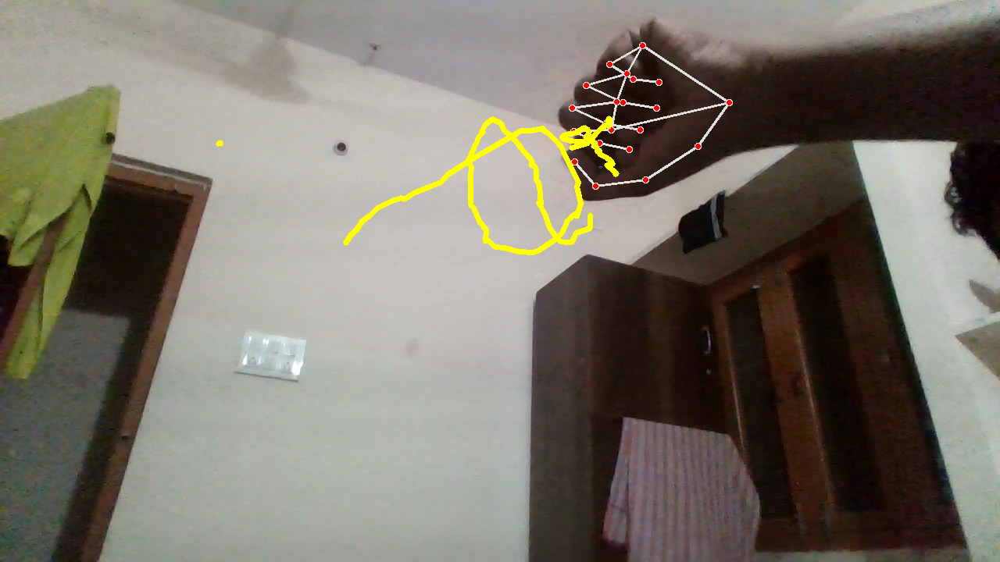
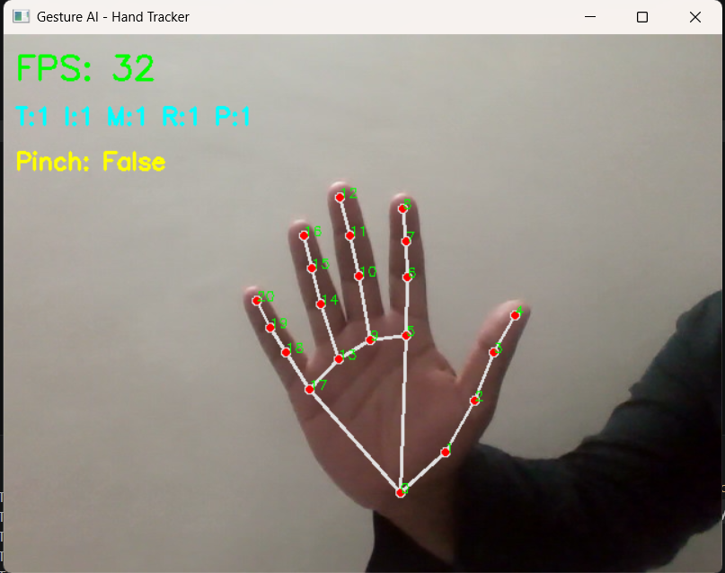
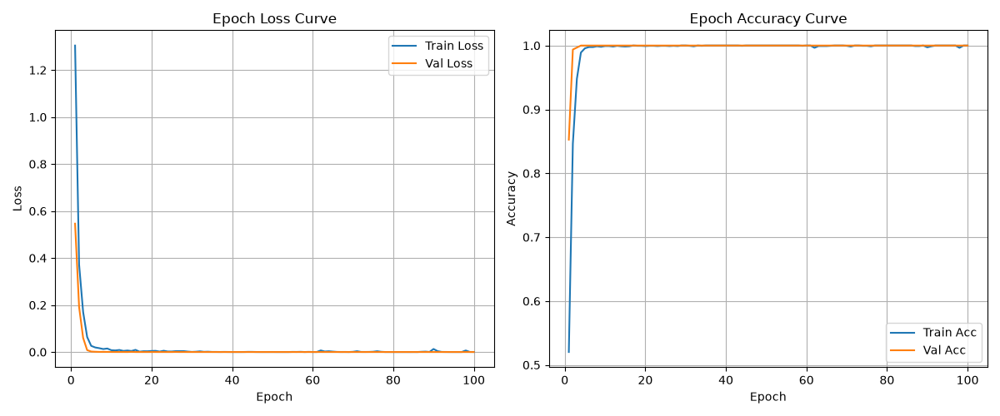

# Gesture AI Toolkit

A real-time **AI-powered hand gesture recognition and control framework** built using **MediaPipe, OpenCV, and PyTorch**. The toolkit provides gesture recognition, AR painting, media control, mouse control, dataset collection, and custom model training capabilities.

---

## Features

- 🎯 **Real-Time Gesture Recognition**
  - Detect and classify hand gestures using a webcam.
  - Supported gestures:
    - Fist
    - Palm
    - Peace
    - Thumbs Up
    - Pointing

- 🎨 **AR Painting**
  - Draw in the air using hand gestures.
  - Clear canvas and capture screenshots.

- 🖱️ **Mouse Control**
  - Control the system cursor using hand movements.
  - Perform click actions using gestures.

- 🎵 **Media Controller**
  - Play/Pause media.
  - Control volume.
  - Seek forward/backward.

- 📊 **Data Collection**
  - Capture custom gesture datasets.

- 🧠 **Model Training**
  - Train custom gesture recognition models using PyTorch.

---

## System Architecture

The overall architecture of the proposed Gesture AI Toolkit is shown below.



---

## Project Structure

```text
gesture-ai/
│
├── control_hub.py
├── media_controller.py
├── collect_data.py
├── train_model.py
├── realtime_inference.py
├── ar_paint.py
├── hand_detect.py
├── test_camera.py
├── model.py
├── requirements.txt
│
├── dataset/
├── models/
├── result/
│
└── README.md
```

---

## Applications

### 1. Gesture AI Control Hub

The main application that combines multiple functionalities.

```bash
python control_hub.py
```

Supported modes:

| Mode | Function |
|------|------|
| Inference | Displays detected gesture |
| Paint | Air drawing |
| Mouse | Cursor control |

#### Paint Mode Controls

| Gesture | Action |
|---------|--------|
| Pointing | Move cursor |
| Fist | Draw |
| Peace | Clear canvas |

---

### 2. Gesture Media Controller

Control multimedia applications using hand gestures.

```bash
python media_controller.py
```

| Gesture | Function |
|---------|----------|
| Palm | Play/Pause |
| Thumbs Up | Play/Pause |
| Pointing | Volume Control |
| Fist | Seek Forward/Backward |

---

## Results and Screenshots

### Media Controller

The system successfully detects gestures and executes media commands in real time.



---

### AR Painting

Real-time drawing using hand gestures.



---

### Air Drawing Example

Example of gesture-based freehand drawing.



---

### Hand Landmark Detection

MediaPipe extracts 21 hand landmarks for gesture recognition.



---

### Model Training Performance

Training accuracy and loss curves obtained during model training.



---

## Installation

### 1. Clone Repository

```bash
git clone https://github.com/VishwatejaPalli/ai_gesture_control.git
cd ai_gesture_control
```

---

### 2. Create Virtual Environment

Windows:

```bash
python -m venv .venv
.venv\Scripts\activate
```

Linux/macOS:

```bash
python3 -m venv .venv
source .venv/bin/activate
```

---

### 3. Install Dependencies

```bash
pip install -r requirements.txt
```

---

## Model Training Workflow

### Step 1: Collect Data

Collect samples for each gesture.

```bash
python collect_data.py <gesture_name> --samples 500
```

Example:

```bash
python collect_data.py ok_sign --samples 500
```

---

### Step 2: Train Model

Update gesture classes in:

```text
train_model.py
```

Then train:

```bash
python train_model.py
```

The trained model is saved as:

```text
models/gesture_model.pth
```

---

### Step 3: Real-Time Inference

Run the inference application.

```bash
python realtime_inference.py
```

The application displays:

- Predicted gesture
- Confidence score
- Hand landmarks

---

### Step 4: AR Painting

Launch the AR painting tool.

```bash
python ar_paint.py
```

Controls:

| Gesture | Function |
|---------|----------|
| Index Finger | Move Pointer |
| Pinch Thumb + Index | Draw |
| Open Palm | Clear Canvas |
| Index + Middle Pinch | Screenshot |

Press:

```text
q
```

to quit.

---

## Technologies Used

- Python
- OpenCV
- MediaPipe
- PyTorch
- NumPy
- PyAutoGUI
- PyCAW

---

## Performance

| Metric | Value |
|---------|---------|
| Gesture Accuracy | 95.6% |
| Frame Rate | 25 FPS |
| Response Time | 52 ms |
| Supported Hands | 2 |

---

## Future Improvements

- Custom deep learning gesture models
- Dynamic gesture recognition using LSTM
- Multi-user support
- VR/AR integration
- IoT device control
- Sign language recognition
- GPU acceleration
- Edge AI deployment

---

## References

1. Zhang et al., *MediaPipe Hands: On-device Real-time Hand Tracking*, 2020.
2. Pavlovic et al., *Visual Interpretation of Hand Gestures for Human-Computer Interaction*, IEEE TPAMI, 1997.
3. Mitra et al., *Gesture Recognition: A Survey*, IEEE SMC, 2007.
4. Google MediaPipe Documentation.
5. OpenCV Official Documentation.

---

## Author

**Vishwateja Palli**,
**Swargam Akhila**

B.Tech Electronics and Communication Engineering  
Vardhaman College of Engineering

GitHub:
https://github.com/VishwatejaPalli
